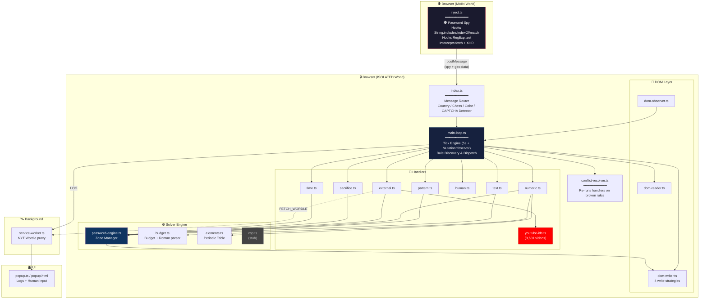

<div align="center">


<h3>The ultimate automated solver for <a href="https://neal.fun/password-game/">The Password Game</a></h3>

<p>
  
  
  
  
  
  
</p>

<p>
  <a href="https://github.com/Tha-Nixo/ThePasswordCrack/stargazers"></a>
  <a href="https://github.com/Tha-Nixo/ThePasswordCrack/issues"></a>
  <a href="https://github.com/Tha-Nixo/ThePasswordCrack/commits/main"></a>
  
</p>

<p><i>A Chrome Extension that intercepts, reverse-engineers, and auto-solves rules in real-time.<br>It reads the game's mind. Literally.</i></p>

<sub>🧠 Constraint solver · 🕵️ Runtime memory spy · 🌐 Network interceptor · ⌨️ ProseMirror writer</sub>

</div>

---

## 📚 Table of Contents

- [🤔 What Is This?](#-what-is-this)
- [🎬 Demo](#-demo)
- [⭐ Highlights](#-highlights)
- [✨ Features at a Glance](#-features-at-a-glance)
- [📊 Rule Coverage](#-rule-coverage)
- [🚀 Quick Start](#-quick-start)
- [🏗️ Architecture](#️-architecture)
- [🕵️ The Password Spy — How It Works](#️-the-password-spy--how-it-works)
- [🎬 YouTube Video Database](#-youtube-video-database)
- [🔬 Atomic Weight Management](#-atomic-weight-management)
- [📁 Project Structure](#-project-structure)
- [🔧 How the Solver Thinks](#-how-the-solver-thinks)
- [🛠️ Troubleshooting](#️-troubleshooting)
- [⚠️ Known Issues, Quirks & Gotchas](#️-known-issues-quirks--gotchas)
- [🤝 Contributing](#-contributing)
- [📜 License](#-license)

---

## 🤔 What Is This?

[The Password Game](https://neal.fun/password-game/) is a devilishly designed web game by [Neal Agarwal](https://nealagarwal.me/) where each new rule contradicts the last. Moon phases, chess puzzles, Wordle answers, GeoGuessr, periodic table elements... the insanity never ends.

**This extension ends it for you.** It watches the game's DOM for new rules, classifies them, dispatches them to specialized handlers, and re-balances competing constraints in real-time — all while typing the answer directly into the editor.

> *"Why play the game when you can reverse-engineer it?"*

---

## 🎬 Demo

<div align="center">

<!-- Drop your screenshot or demo GIF here -->
<sub><i>📸 Demo GIF coming soon — drop your recording in <code>docs/demo.gif</code> and update this section.</i></sub>

</div>

---

## ⭐ Highlights

> [!TIP]
> The four tricks that make the whole thing tick. Everything else is plumbing around these.

<table>
<tr>
<td width="50%" valign="top">

### 🕵️ Memory Spy
Hooks `String.includes`, `indexOf`, `match` and `RegExp.test` to **intercept the game checking your password** against hidden answers. We learn what the game wants *before* it tells us if we got it right.

</td>
<td width="50%" valign="top">

### 🧠 Multi-Constraint Solver
Greedy solver that simultaneously satisfies **digit sums, Roman numeral products, and atomic-number targets** — three competing math constraints, one password, no compromises.

</td>
</tr>
<tr>
<td width="50%" valign="top">

### 🌐 Network Interceptor
Patches `fetch` + `XMLHttpRequest` to **catch the GeoGuessr `/street-view` payload** before the validator ever sees it. Two-layer fallback to spy-mode if the API path changes.

</td>
<td width="50%" valign="top">

### ⌨️ ProseMirror Writer
4-strategy escalation ladder (`execCommand` → `inputEvent` → `pmDirect` → `pmHack`) **auto-detected at startup**. If one path breaks, the next one takes over.

</td>
</tr>
</table>

---

## ✨ Features at a Glance

| Feature | Description |
|---|---|
| 🧠 **Constraint Solver** | Greedy multi-target solver that simultaneously satisfies digit sums, Roman numeral products, and atomic number targets |
| 🕵️ **Memory Spy** | Hooks `String.prototype.includes`, `indexOf`, `match`, and `RegExp.test` to intercept the game checking your password against hidden answers |
| 🌐 **Network Spy** | Hooks `fetch` + `XMLHttpRequest` to catch the GeoGuessr `/street-view` payload before it ever reaches the validator |
| ♟️ **Chess Auto-Solve** | Captures the best move in algebraic notation directly from the game's validation logic (regex-filtered to avoid false positives) |
| 🗺️ **GeoGuessr Auto-Solve** | Two-layer detection: API intercept first, country-name spy as fallback |
| 📖 **Wordle Intercept** | Pulls today's answer from the official NYT API via the background service worker |
| ⚗️ **Periodic Table Engine** | Full element scanner + greedy generator that hits exact atomic-number sums while avoiding Roman pollution |
| 🥚 **Paul Lifecycle** | Manages Paul from egg → hatched chicken → feeding (🐔🐛🐛🐛), auto-transitioning on rule text changes |
| 🎬 **YouTube Database** | 3,601-video lookup table for instant duration-matched URL injection |
| 🔤 **Smart HTML Formatting** | Vowel bolding, italic-vs-bold ratio, Wingdings %, Times New Roman for romans, font-size = digit² |
| ⌨️ **ProseMirror Writer** | 4-strategy escalation ladder (`execCommand` → `inputEvent` → `pmDirect` → `pmHack`) auto-detected at startup |
| 🩸 **Sacrifice Engine** | Automatically identifies unused letters to pass Rule 25 without breaking the password |
| 🎨 **Dual-Layer Color Intercept** | Combines CSS `getComputedStyle()` scraping with memory-spy interception to grab the Rule 28 hex code |
| ⚖️ **Conflict Resolver** | Re-runs handlers when rules break after a write, with safety checks against budget violations |
| 📐 **Digit-Overflow Compensation** | Dynamically swaps base password / leap year content when locked zones contribute too many digits |

---

## 📊 Rule Coverage

| # | Rule | Strategy | Status |
|---|------|----------|--------|
| 1 | Min 5 characters | `base word` | ✅ Auto |
| 2 | Include a number | `base word` | ✅ Auto |
| 3 | Include uppercase | `base word` | ✅ Auto |
| 4 | Include special char | `base word` | ✅ Auto |
| 5 | Digits sum to 25 | `NumericSolver` | ✅ Auto |
| 6 | Include a month | `PatternHandler` | ✅ Auto |
| 7 | Include Roman numeral | `NumericSolver` | ✅ Auto |
| 8 | Include a sponsor | `TextHandler` | ✅ Auto |
| 9 | Roman numerals multiply to 35 | `NumericSolver` | ✅ Auto |
| 10 | CAPTCHA | `Spy → includes() hook (overlay fallback)` | ✅ Auto |
| 11 | Wordle answer | `Spy → API intercept` | ✅ Auto |
| 12 | Periodic table element | `TextHandler` | ✅ Auto |
| 13 | Moon phase emoji | `TextHandler` | ✅ Auto |
| 14 | GeoGuessr country | `fetch/XHR + includes() spy` | ✅ Auto |
| 15 | Leap year | `TextHandler` | ✅ Auto |
| 16 | Chess best move | `Spy → includes() hook` | ✅ Auto |
| 17 | Chicken Paul 🥚 | `TextHandler` | ✅ Auto |
| 18 | Atomic numbers sum to 200 | `ElementSolver` | ✅ Auto |
| 19 | Bold all vowels | `formatPassword()` | ✅ Auto |
| 20 | Password on fire 🔥 | `ConflictResolver` | ✅ Auto |
| 21 | Not strong enough 🏋️ | `TextHandler` | ✅ Auto |
| 22 | Affirmation | `TextHandler` | ✅ Auto |
| 23 | Feed Paul 🐛🐛🐛 | `TextHandler` | ✅ Auto |
| 24 | YouTube video URL | `ExternalHandler + YouTube DB` | ✅ Auto |
| 25 | A sacrifice must be made | `SacrificeHandler` | ✅ Auto |
| 26 | Italic vs Bold ratio | `formatPassword()` | ✅ Auto |
| 27 | 30% Wingdings | `formatPassword()` | ✅ Auto |
| 28 | Color in hex | `Spy + DOMReader fallback` | 🧪 Experimental |
| 29 | Roman numerals in Times New Roman | `formatPassword()` | 🧪 Experimental |
| 30 | Digit font size = digit² | `formatPassword()` | 🧪 Experimental |
| 31 | Same letter, different font sizes | `formatPassword()` | 🧪 Experimental |
| 32+ | *Work in progress...* | — | 🔜 |

> [!NOTE]
> **Experimental** = code path exists but is not yet validated end-to-end against the live game. Likely to break under conflict-resolution scenarios or under specific game-state timing.

---

## 🚀 Quick Start

```bash
# Clone
git clone https://github.com/Tha-Nixo/ThePasswordCrack.git
cd ThePasswordCrack

# Install & Build
npm install
node esbuild.config.mjs
```

**Load in Chrome:**
1. Navigate to `chrome://extensions`
2. Enable **Developer mode** (top right)
3. Click **Load unpacked** → select the project root folder
4. Go to [neal.fun/password-game](https://neal.fun/password-game/) and watch the magic ✨

> [!TIP]
> **Building on a different OS than the one used last?** esbuild ships native binaries — re-run `npm install` so the right `@esbuild/<platform>` package gets pulled. Otherwise the build fails with *"You installed esbuild for another platform"*.

> [!WARNING]
> Pure `tsc` is not a supported build path right now (some legacy import paths). Always build through `node esbuild.config.mjs`. See [Known Issues](#️-known-issues-quirks--gotchas).

---

## 🏗️ Architecture



---

## 🕵️ The Password Spy — How It Works

The most critical innovation of this project. The game validates your password by calling `.includes("chile")` or `.includes("Qg1+")` directly on your input string. **We hook that.**

```typescript
// inject.ts — Runs in MAIN world alongside the game
const originalIncludes = String.prototype.includes;
String.prototype.includes = function(search, position) {
    if (isOurPassword(this) && typeof search === "string" && search.length > 2) {
        // 🕵️ Exfiltrate what the game is checking against
        window.postMessage({ type: "PWG_SPY_INCLUDES", str: search }, "*");
    }
    return originalIncludes.call(this, search, position);
};
```

When the game checks if your password contains `"chile"` (GeoGuessr) or `"Qg1+"` (Chess), our spy catches it *before* the game even decides if you're right or wrong. We then feed that exact answer back into the password.

The same trick is applied to `String.prototype.indexOf`, `String.prototype.match`, and `RegExp.prototype.test` for full coverage. A second layer hooks `window.fetch` and `XMLHttpRequest` to grab the GeoGuessr `/street-view` JSON response directly.

> [!IMPORTANT]
> The spy's `isOurPassword()` detection function uses `originalIncludes.call()` internally to avoid infinite recursion — calling the hooked `.includes()` from within the hook itself would stack overflow.

**Zero external APIs (except the official NYT Wordle endpoint). Zero browser automation. Just pure interception.**

---

## 🎬 YouTube Video Database

Rule 24 requires a YouTube video of a specific duration. Instead of scraping YouTube at runtime (unreliable, slow, rate-limited), we use a pre-built database of **3,601 videos** indexed by their duration in seconds.

```
youtube-ids.ts → youtubeIds[totalSeconds] → video ID
```

| Duration Requested | Lookup | Result |
|---|---|---|
| `14 min 39 sec` | `youtubeIds[879]` | `MELjQPlB-Co` |
| `4 min 20 sec` | `youtubeIds[260]` | `64BymbStTYY` |

The URL is injected as a `youtu.be` short-link wrapped in an HTML anchor:
```html
<a href="https://youtu.be/MELjQPlB-Co">https://youtu.be/MELjQPlB-Co</a>
```

The `youtu.be` form saves the letters `w`, `w`, `w`, `.`, `c`, `o`, `m`, `/`, `w`, `a`, `t`, `c`, `h`, `?`, `v`, `=` compared to the long form — fewer pollutants for both Roman and atomic-number constraints.

---

## 🔬 Atomic Weight Management

One of the trickiest challenges is Rule 18 (atomic numbers sum to 200). Every uppercase letter in the password potentially matches a periodic table element. The solver controls this by:

1. **Low-pollution base word**: `A!111` — minimized unique letters to reserve "unused" characters for Rule 25 (Sacrifice).
2. **Lowercase month**: `february` instead of `February` — avoids `Fe` (Iron, 26) contamination.
3. **Lowercase affirmation**: `i am loved` instead of `I am loved` — avoids `I` (Iodine, 53).
4. **Dynamic element injection**: the `ElementSolver` calculates the gap between current atomic sum and the target, then greedily injects high-atomic-number 2-letter symbols (e.g., `Og`=118, `Gd`=64) to minimize length.
5. **Roman-safe element pool**: elements starting with `I`, `V`, `X`, `L`, `C`, `D`, `M` are filtered out of the generator so they don't break the Roman product constraint.
6. **URL & domain optimization**: shortened `youtu.be` links wrapped in `<a>` tags hide uppercase letters from the element scanner.
7. **Digit-overflow compensation**: when other zones contribute too many digits, the loop dynamically swaps the leap-year zone (`2000`, `400`, `1200`, `10000`...) for one with a lower digit sum.

---

## 📁 Project Structure

```
ThePasswordCrack/
├── manifest.json              # Chrome Extension Manifest V3
├── esbuild.config.mjs         # Build config
├── popup.html / popup.css     # Extension popup UI
│
├── src/
│   ├── background/
│   │   └── service-worker.ts  # Wordle proxy + log relay
│   ├── popup/
│   │   └── popup.ts           # Logs viewer + human-input form
│   ├── shared/
│   │   ├── types.ts           # Shared interfaces
│   │   ├── messages.ts        # Background ↔ content message types
│   │   └── unicode.ts         # Grapheme-safe string utils
│   └── content/
│       ├── inject.ts          # 🕵️ MAIN world spy (fetch, XHR, includes, indexOf, match, test)
│       ├── index.ts           # Message router & init
│       ├── main-loop.ts       # Core tick engine + formatPassword()
│       ├── password-engine.ts # Zone-based password builder
│       ├── rule-classifier.ts # Rule categorization
│       ├── conflict-resolver.ts
│       ├── dom-reader.ts      # Read rules from DOM (incl. Rule 28 color)
│       ├── dom-writer.ts      # Write to ProseMirror editor (4 strategies)
│       ├── dom-observer.ts    # MutationObserver + polling fallback
│       ├── handlers/
│       │   ├── text.ts        # Sponsor, moon, egg/Paul, strength, affirmation
│       │   ├── pattern.ts     # Month selection (lowercase, low roman pollution)
│       │   ├── numeric.ts     # Digit sum, Roman product, Atomic sum solver
│       │   ├── external.ts    # Wordle, GeoGuessr, Chess, YouTube
│       │   ├── youtube-ids.ts # 3,601-video duration→ID lookup database
│       │   ├── sacrifice.ts   # Rule 25 letter sacrifice automation
│       │   ├── time.ts        # (reserved) current-time handler
│       │   └── human.ts       # CAPTCHA fallback (in-page overlay prompt)
│       └── solver/
│           ├── budget.ts      # Constraint budget tracker + Roman parser
│           ├── elements.ts    # Periodic table + element generator
│           └── csp.ts         # (placeholder, currently empty)
│
└── dist/                      # Built output (auto-generated)
```

---

## 🔧 How the Solver Thinks

Every **5 seconds** (or on DOM mutation), the main loop:

1. 📖 **Reads** all visible rules from the DOM
2. 🏷️ **Classifies** new rules (`text`, `numeric`, `pattern`, `external`, `human`, `sacrifice`, `time`)
3. 🧩 **Dispatches** each rule to the appropriate handler
4. ⚖️ **Re-balances** ALL numeric constraints together (digit sum + Roman product + atomic sum)
5. 🔤 **Formats** the password (HTML-aware vowel bolding, italics, Wingdings, font sizes…)
6. ⌨️ **Types** the final password into the editor (auto-detected ProseMirror strategy)
7. ✅ **Verifies** the typed text matches what was intended
8. 🔁 **Conflict-resolves** any rules that broke from the new content

The password is built from **priority-sorted zones**:

```
┌──────────┬──────────┬──────────┬──────┬──────┬────────┬────────┬─────────┬──────────┬───────┐
│  base    │ periodic │ pattern  │digits│roman │elements│leapyear│  egg    │ external │ human │
│"strong-  │  "He"    │"february"│ "29" │"XXXV"│  "Gd"  │ "2000" │"🐔🐛🐛🐛"│"russia"  │"mgw3n"│
│password1A│          │ "pepsi"  │      │      │        │        │         │ chess/yt │       │
│  !"      │          │          │      │      │        │        │         │          │       │
│ pri: 10  │ pri: 15  │ pri: 30  │pr: 40│pr: 50│ pr: 60 │ pr: 50 │ pri: 70 │ pri: 80+ │pr:100 │
└──────────┴──────────┴──────────┴──────┴──────┴────────┴────────┴─────────┴──────────┴───────┘
                              ↓ concatenated by priority ↓
  "strongpassword1A!Hefebruaryeerie29XXXV2000Gd🌔pepsi🐔🐛🐛🐛🏋️‍♂️🏋️‍♂️🏋️‍♂️i am loved
   <a href="...youtube...">...youtube...</a> russiaRg8+mgw3n"
```

---

## 🛠️ Troubleshooting

| Symptom | Likely Cause | Fix |
|---|---|---|
| `FATAL: No write strategy produced a detectable state change` | The game's editor markup changed | Inspect the contenteditable element + ProseMirror view path; update `dom-writer.ts` (see `SELECTORS.md`) |
| `MATH IMPOSSIBLE: Rule 5 requires digit sum to be N` | Locked zones (CAPTCHA, YouTube ID) already contribute too many digits | Reload the page to roll a new random state |
| `MATH IMPOSSIBLE: Rule 9 requires Roman numerals to multiply to N` | Locked zone polluted the Roman product with a non-divisible factor | Reload the page |
| Extension stops logging mid-game | Chrome invalidated the extension context (auto-reload, devtools…) | Reload the page; the loop self-stops on context death |
| `You installed esbuild for another platform` | `node_modules` copied across OSes | `rm -rf node_modules && npm install` |
| TypeScript compile errors on `tsc` | Some imports use legacy paths *(see "Known Issues")* | Build with `node esbuild.config.mjs` (works) — pure `tsc` is not a supported build path right now |

---

## ⚠️ Known Issues, Quirks & Gotchas

A frank list of things found while auditing the project — useful both for users and contributors. Nothing here is a showstopper for normal play, but each item is a real footgun.

### 🐛 Bugs

- **Inconsistent import paths.** A handful of files in `src/content/` reference `"../../shared/types"` and `"../password-engine"` instead of `"../shared/types"` / `"./password-engine"`. esbuild's bundler resolves them anyway, but `tsc --noEmit` fails. Affected files: `conflict-resolver.ts`, `dom-reader.ts`, `password-engine.ts`, `rule-classifier.ts`. → **Status: cosmetic, esbuild build still ships.**
- **`RomanParser.findAllRomanSubstrings` is missing.** `budget.ts` references the method in the `"maximal_munch"` branch but never implements it. Currently harmless because the default strategy is `"contiguous"`, but switching strategies will throw at runtime.
- **`ConflictResolver` only iterates once.** `maxAttempts = 8` is declared but the loop ends with an unconditional `break;`. Most retries actually happen on the next main-loop tick, so it works in practice — but the explicit retry budget is dead code.
- **`solveWithLengthConstraint` is a stub.** When the digit ratio constraint trips (Rule 5 + Rule 27 cross-talk), the solver returns `{ digits: "0" }` instead of computing a real fallback.
- **`csp.ts` is an empty class.** Listed in the architecture but contributes nothing today.
- **`findWordleInDOM` always returns `null`.** Marked `INSPECT_LIVE_PAGE`. The Wordle path therefore relies entirely on the NYT API proxy — if the API is unreachable (offline, blocked, rate-limited), Rule 11 falls back to manual input.
- **`dist/background.js` may exist as a stale artifact.** esbuild outputs `dist/service-worker.js` (matching the manifest); any `background.js` file is a leftover from earlier configs and can be safely deleted.
- **No `chrome` types in `tsconfig.json`.** Compiles fine through esbuild thanks to bundling, but `tsc` doesn't see `@types/chrome` until you add `"types": ["chrome"]`.
- **`XMLHttpRequest._url`** is monkey-patched in `inject.ts` without a TS declaration — runtime works, type-checker complains.

### 🧱 Limitations

- **CAPTCHA (Rule 10)** — auto-solved when the spy catches the `includes()` check on the captcha string. If the spy misses (e.g. timing issue, alternate validation path), the in-page overlay prompts for manual input. Pure image-based variants will always require the human fallback.
- **Color picker (Rule 28)** — code path exists (spy + `getComputedStyle()` fallback) but is **not yet validated end-to-end**. The hex value is captured inconsistently, depending on when the rule activates relative to the DOM mutation. Currently treated as experimental — expect to fall back to manual color entry.
- **Rules 29 / 30 / 31** — code paths exist in `formatPassword()` but are not yet validated against the live game. Treat as experimental.
- **Element detection** — uses a greedy left-to-right scanner (same as the game). Edge cases with overlapping symbols may still occur.
- **YouTube database** — covers durations from 0 to 3,600 seconds (1 minute over an hour). Anything outside that range falls back to manual input.
- **`PatternHandler`** uses a hard-coded mock `romanTarget = 35`. The current month picker happens to land on `february` either way, but the logic is not actually data-driven yet.
- **`SacrificeHandler`** picks the first two alphabetically-unused letters without scoring their safety against other rules. Usually fine; worth knowing if a sacrifice round breaks a constraint.
- **`countryBatchSeen`** flag resets after 3 s. If a new GeoGuessr round starts within that window, the second country may be missed until the next tick.
- **No unit tests.** `npm test` is a stub. The whole project is "trust the live page".
- **No extension icon** declared in the manifest — Chrome will use a placeholder.

### 🧪 Experimental / TODO

- Wire `csp.ts` to the numeric solver (or remove it from the architecture diagram).
- Add a real fallback for `solveWithLengthConstraint`.
- Stabilize Rule 28 (color picker) — the spy catches the hex inconsistently; investigate timing vs. the rule's activation event.
- Validate Rules 29–31 end-to-end against the live game.
- Promote `ConflictResolver` retries from "next tick" to "in-loop with budget enforcement".
- Add an option in the popup to pause/resume the loop manually.

---

## 🤝 Contributing

PRs are welcome! The codebase is modular — to add a new rule handler:

1. Add detection keywords in `rule-classifier.ts`
2. Create your handler logic in `src/content/handlers/`
3. Register it in `src/content/index.ts` (the handlers `Map`)
4. If the rule needs special formatting, extend `formatPassword()` in `main-loop.ts`
5. If the rule introduces a new global constraint, teach `BudgetTracker` about it

> [!TIP]
> When the game updates, check `SELECTORS.md` first — most regressions are just CSS class renames.

---

## 📜 License

MIT — Do whatever you want with it.

---

<div align="center">

<sub>Built with 🧠, ☕, and an unreasonable amount of spite towards Rules 18 and 24.</sub>

<br><br>

<a href="https://github.com/Tha-Nixo"></a>
<a href="https://tiktok.com/@tha_nixo"></a>
<a href="https://discord.gg/skC9z79Xwf"></a>

<br><br>

<sub>Disclaimer: Educational project exploring DOM manipulation, runtime interception, and constraint solving.<br>All rights for The Password Game belong to <a href="https://nealagarwal.me/">Neal Agarwal</a>.</sub>

</div>