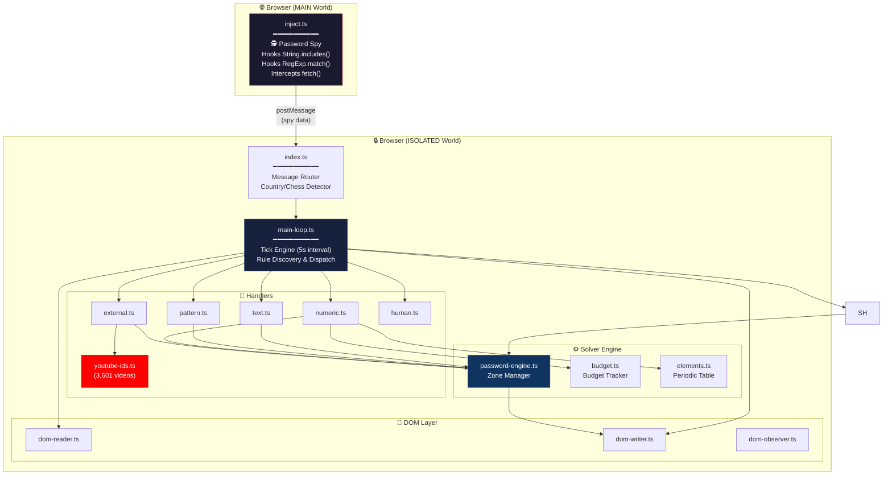

<div align="center">

<h1>🔐 The Password Crack</h1>
<h3>The ultimate automated solver for <a href="https://neal.fun/password-game/">The Password Game</a></h3>

<p>
  
  
  
  
</p>

<p><i>A Chrome Extension that intercepts, reverse-engineers, and auto-solves rules in real-time.<br>It reads the game's mind. Literally.</i></p>

</div>

---

## 🤔 What Is This?

[The Password Game](https://neal.fun/password-game/) is a devilishly designed web game by [Neal Agarwal](https://nealagarwal.me/) where each new rule contradicts the last. Moon phases, chess puzzles, Wordle answers, GeoGuessr, periodic table elements... the insanity never ends.

**This extension ends it for you.** It watches the game's DOM for new rules, classifies them, dispatches them to specialized handlers, and re-balances competing constraints in real-time — all while typing the answer directly into the editor.

> *"Why play the game when you can reverse-engineer it?"*

---

## ✨ Features at a Glance

| Feature | Description |
|---|---|
| 🧠 **Constraint Solver** | CSP engine that simultaneously satisfies digit sums, Roman numeral products, and atomic number targets |
| 🕵️ **Memory Spy** | Hooks `String.prototype.includes` to intercept the game checking your password against hidden answers |
| ♟️ **Chess Auto-Solve** | Captures the best move in algebraic notation directly from the game's validation logic |
| 🗺️ **GeoGuessr Auto-Solve** | Detects the country name from the game's internal `includes()` sweep of 195 countries |
| 📖 **Wordle Intercept** | Grabs today's Wordle answer from the API response the game itself fetches |
| ⚗️ **Periodic Table Engine** | Full element scanner + generator to hit exact atomic number sums |
| 🥚 **Paul Lifecycle** | Manages Paul from egg → hatching → feeding (🐔🐛🐛🐛), auto-transitioning on rule text changes |
| 🎬 **YouTube Database** | 3,601-video lookup table for instant duration-matched URL injection |
| 🔤 **Smart Formatting** | HTML-aware vowel bolding that preserves URLs and tag integrity |
| ⌨️ **ProseMirror Writer** | Escalation ladder to inject text into the game's rich-text editor |
| 🩸 **Sacrifice Engine** | Automatically identifies unused letters to pass Rule 25 without breaking the password |
| 🎨 **Dual-Layer Color Intercept** | Combines CSS computed-style scraping with memory-spy interception to grab the Rule 28 hex code |

---

## 📊 Rule Coverage

| # | Rule | Strategy | Status |
|---|------|----------|--------|
| 1 | Min 5 characters | `base word` | ✅ Auto |
| 2 | Include a number | `base word` | ✅ Auto |
| 3 | Include uppercase | `base word` | ✅ Auto |
| 4 | Include special char | `base word` | ✅ Auto |
| 5 | Digits sum to 25 | `NumericSolver` | ✅ Auto |
| 6 | Include a month | `PatternHandler` | ✅ Auto |
| 7 | Include Roman numeral | `NumericSolver` | ✅ Auto |
| 8 | Include a sponsor | `TextHandler` | ✅ Auto |
| 9 | Roman numerals multiply to 35 | `NumericSolver` | ✅ Auto |
| 10 | CAPTCHA | `HumanHandler` | ⏸️ Manual |
| 11 | Wordle answer | `Spy → API intercept` | ✅ Auto |
| 12 | Periodic table element | `TextHandler` | ✅ Auto |
| 13 | Moon phase emoji | `TextHandler` | ✅ Auto |
| 14 | GeoGuessr country | `Spy → includes() hook` | ✅ Auto |
| 15 | Leap year | `TextHandler` | ✅ Auto |
| 16 | Chess best move | `Spy → includes() hook` | ✅ Auto |
| 17 | Chicken Paul 🥚 | `TextHandler` | ✅ Auto |
| 18 | Atomic numbers sum to 200 | `ElementSolver` | ✅ Auto |
| 19 | Bold all vowels | `formatPassword()` | ✅ Auto |
| 20 | Password on fire 🔥 | `ConflictResolver` | ✅ Auto |
| 21 | Not strong enough 🏋️ | `TextHandler` | ✅ Auto |
| 22 | Affirmation | `TextHandler` | ✅ Auto |
| 23 | Feed Paul 🐛🐛🐛 | `TextHandler` | ✅ Auto |
| 24 | YouTube video URL | `ExternalHandler + YouTube DB` | ✅ Auto |
| 25 | A sacrifice must be made | `SacrificeHandler` | ✅ Auto |
| 26 | Italic vs Bold ratio | `formatPassword()` | ✅ Auto |
| 27 | 30% Wingdings | `formatPassword()` | ✅ Auto |
| 28 | Color in hex | `Spy + DOMReader` | ✅ Auto |
| 29+ | *Work in progress...* | — | 🔜 |

---

## 🏗️ Architecture



---

## 🕵️ The Password Spy — How It Works

The most critical innovation of this project. The game validates your password by calling `.includes("chile")` or `.includes("Qg1+")` directly on your input string. We hook that.

```typescript
// inject.ts — Runs in MAIN world alongside the game
const originalIncludes = String.prototype.includes;
String.prototype.includes = function(search, position) {
    // 🕵️ Exfiltrate what the game is checking against
    window.postMessage({ 
        type: "PWG_SPY_INCLUDES", 
        candidate: search 
    }, "*");
    return originalIncludes.call(this, search, position);
};
```

When the game checks if your password contains `"chile"` (GeoGuessr) or `"Qg1+"` (Chess), our spy catches it *before* the game even decides if you're right or wrong. We then feed that exact answer back into the password.

> **Important:** The spy's `isOurPassword()` detection function uses `originalIncludes.call()` internally to avoid infinite recursion — calling the hooked `.includes()` from within the hook itself would stack overflow.

**Zero external APIs. Zero browser automation. Just pure interception.**

---

## 🎬 YouTube Video Database

Rule 24 requires a YouTube video of a specific duration. Instead of scraping YouTube at runtime (unreliable, slow, rate-limited), we use a pre-built database of **3,601 videos** from a community-maintained playlist.

```
youtube-ids.ts → youtubeIds[totalSeconds] → video ID
```

| Duration Requested | Lookup | Result |
|---|---|---|
| `14 min 39 sec` | `youtubeIds[879]` | `MELjQPlB-Co` |
| `4 min 20 sec` | `youtubeIds[260]` | `64BymbStTYY` |

The URL is injected as an **HTML anchor tag** with lowercased visible text:
```html
<a href="https://www.youtube.com/watch?v=MELjQPlB-Co">https://www.youtube.com/watch?v=meljqplb-co</a>
```

This is critical because video IDs often contain uppercase letters like `M`, `L`, `C`, `V`, `I` — which the game would interpret as **Roman numerals** (breaking Rule 9) or **element symbols** (breaking Rule 18). By lowercasing the visible text, the game's `innerText` parser sees no Roman pollution and no element pollution, while the `href` preserves the real URL for link validation.

---

## 🔬 Atomic Weight Management

One of the trickiest challenges is Rule 18 (atomic numbers sum to 200). Every uppercase letter in the password potentially matches a periodic table element. The solver controls this by:

1. **Low-pollution base word**: `A!111` — minimized unique letters to reserve "unused" characters for Rule 25 (Sacrifice)
2. **Lowercase month**: `february` instead of `February` — avoids `Fe` (Iron, 26) contamination
3. **Lowercase affirmation**: `i am loved` instead of `I am loved` — avoids `I` (Iodine, 53)
4. **Dynamic element injection**: The `ElementSolver` calculates the gap between current atomic sum and 200, then injects the minimal set of element symbols (e.g., `Gd` for Gadolinium = 64)
5. **URL & Domain optimization**: Uses shortened `youtu.be` links to save letters like `C`, `W`, and `M`. YouTube URLs are wrapped in `<a>` tags to hide uppercase letters from the element scanner.

---

## 🚀 Quick Start

```bash
# Clone
git clone https://github.com/Tha-Nixo/ThePasswordCrack.git
cd ThePasswordCrack

# Install & Build
npm install
node esbuild.config.mjs

# Load in Chrome
# 1. Navigate to chrome://extensions
# 2. Enable "Developer mode" (top right)
# 3. Click "Load unpacked" → select the project root folder
# 4. Go to https://neal.fun/password-game/ and watch the magic ✨
```

---

## 📁 Project Structure

```
ThePasswordCrack/
├── manifest.json              # Chrome Extension Manifest V3
├── esbuild.config.mjs         # Build config
├── popup.html / popup.css     # Extension popup UI
│
├── src/
│   ├── background/            # Service worker
│   ├── popup/                 # Popup logic
│   ├── shared/                # Types, Unicode utils
│   └── content/
│       ├── inject.ts          # 🕵️ MAIN world spy (fetch + includes hooks)
│       ├── index.ts           # Message router & init
│       ├── main-loop.ts       # Core tick engine
│       ├── password-engine.ts # Zone-based password builder
│       ├── rule-classifier.ts # Rule categorization
│       ├── dom-reader.ts      # Read rules from DOM
│       ├── dom-writer.ts      # Write to ProseMirror editor
│       ├── dom-observer.ts    # MutationObserver watcher
│       ├── conflict-resolver.ts
│       ├── handlers/
│       │   ├── text.ts        # Sponsor, moon, egg/Paul, strength, affirmation
│       │   ├── pattern.ts     # Month selection (lowercase, low roman pollution)
│       │   ├── numeric.ts     # Digit sum, Roman product, Atomic sum solver
│       │   ├── external.ts    # Wordle, GeoGuessr, Chess, YouTube
│       │   ├── youtube-ids.ts # 3,601-video duration→ID lookup database
│       │   └── human.ts       # CAPTCHA fallback (popup prompt)
│       └── solver/
│           ├── budget.ts      # Constraint budget tracker
│           ├── elements.ts    # Periodic table + element generator
│           └── csp.ts         # CSP primitives
│
└── dist/                      # Built output (auto-generated)
```

---

## 🔧 How the Solver Thinks

Every **5 seconds** (or on DOM mutation), the main loop:

1. 📖 **Reads** all visible rules from the DOM
2. 🏷️ **Classifies** new rules (`text`, `numeric`, `pattern`, `external`, `human`)
3. 🧩 **Dispatches** each rule to the appropriate handler
4. ⚖️ **Re-balances** ALL numeric constraints together (digit sum + Roman product + atomic sum)
5. 🔤 **Formats** the password (HTML-aware vowel bolding for Rule 19)
6. ⌨️ **Types** the final password into the editor
7. ✅ **Verifies** the typed text matches what was intended
8. 🔁 **Conflict-resolves** any rules that broke from the new content

The password is built from **priority-sorted zones**:

```
┌──────────┬──────────┬──────────┬──────┬──────┬────────┬────────┬─────────┬──────────┬───────┐
│  base    │ periodic │ pattern  │digits│roman │elements│leapyear│  egg    │ external │ human │
│"strong-  │  "He"    │"february"│ "29" │"XXXV"│  "Gd"  │ "2000" │"🐔🐛🐛🐛"│"russia"  │"mgw3n"│
│password1A│          │ "pepsi"  │      │      │        │        │         │ chess/yt │       │
│  !"      │          │          │      │      │        │        │         │          │       │
│ pri: 10  │ pri: 15  │ pri: 30  │pr: 40│pr: 50│ pr: 60 │ pr: 50 │ pri: 70 │ pri: 80+ │pr:100 │
└──────────┴──────────┴──────────┴──────┴──────┴────────┴────────┴─────────┴──────────┴───────┘
                              ↓ concatenated by priority ↓
  "strongpassword1A!Hefebruaryeerie29XXXV2000Gd🌔pepsi🐔🐛🐛🐛🏋️‍♂️🏋️‍♂️🏋️‍♂️i am loved
   <a href="...youtube...">...youtube...</a> russiaRg8+mgw3n"
```

---

## ⚠️ Known Limitations

- **CAPTCHA (Rule 10)** — Requires human input. The extension pauses and prompts you via the popup.
- **Rules 25+** — Still being implemented. The architecture supports adding new handlers easily.
- **Element Detection** — Uses a greedy left-to-right scanner (same as the game). Edge cases with overlapping symbols may occur.
- **YouTube Database** — Covers durations from 1 second to 3,601 seconds (~60 minutes). Videos outside this range will fall back to manual input.

---

## 🤝 Contributing

PRs are welcome! The codebase is modular — to add a new rule handler:

1. Add detection keywords in `rule-classifier.ts`
2. Create your handler logic in `handlers/`
3. Register it in `main-loop.ts`

---

## 📜 License

MIT — Do whatever you want with it.

---

<div align="center">
  <br>
  <i>Built with 🧠, ☕, and an unreasonable amount of spite towards Rules 18 and 24.</i>
  <br><br>
  <sub>Disclaimer: Educational project exploring DOM manipulation, runtime interception, and constraint solving.<br>All rights for The Password Game belong to <a href="https://nealagarwal.me/">Neal Agarwal</a>.</sub>
</div>
