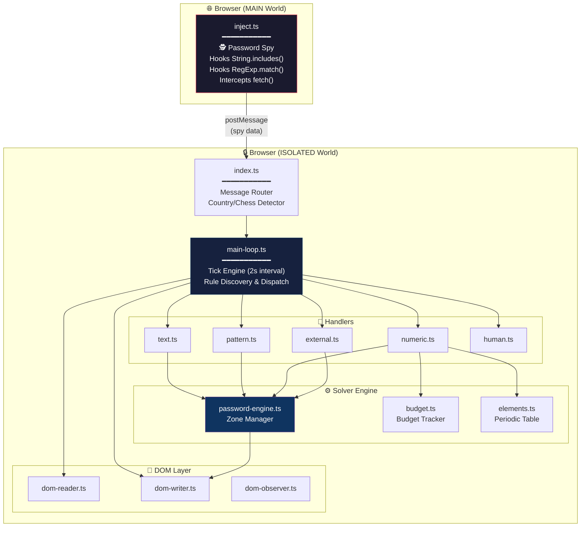

<div align="center">

<h1>🔐 The Password Crack</h1>
<h3>The ultimate automated solver for <a href="https://neal.fun/password-game/">The Password Game</a></h3>

<p>
  
  
  
  
</p>

<p><i>A Chrome Extension that intercepts, reverse-engineers, and auto-solves rules in real-time.<br>It reads the game's mind. Literally.</i></p>

</div>

---

## 🤔 What Is This?

[The Password Game](https://neal.fun/password-game/) is a devilishly designed web game by [Neal Agarwal](https://nealagarwal.me/) where each new rule contradicts the last. Moon phases, chess puzzles, Wordle answers, GeoGuessr, periodic table elements... the insanity never ends.

**This extension ends it for you.** It watches the game's DOM for new rules, classifies them, dispatches them to specialized handlers, and re-balances competing constraints in real-time — all while typing the answer directly into the editor.

> *"Why play the game when you can reverse-engineer it?"*

---

## ✨ Features at a Glance

| Feature | Description |
|---|---|
| 🧠 **Constraint Solver** | CSP engine that simultaneously satisfies digit sums, Roman numeral products, and atomic number targets |
| 🕵️ **Memory Spy** | Hooks `String.prototype.includes` to intercept the game checking your password against hidden answers |
| ♟️ **Chess Auto-Solve** | Captures the best move in algebraic notation directly from the game's validation logic |
| 🗺️ **GeoGuessr Auto-Solve** | Detects the country name from the game's internal `includes()` sweep of 195 countries |
| 📖 **Wordle Intercept** | Grabs today's Wordle answer from the API response the game itself fetches |
| ⚗️ **Periodic Table Engine** | Full element scanner + generator to hit exact atomic number sums |
| 🥚 **Paul Protection** | Keeps the egg emoji safe in the password at all costs |
| ⌨️ **ProseMirror Writer** | Escalation ladder to inject text into the game's rich-text editor |

---

## 📊 Rule Coverage

| # | Rule | Strategy | Status |
|---|------|----------|--------|
| 1 | Min 5 characters | `base word` | ✅ Auto |
| 2 | Include a number | `base word` | ✅ Auto |
| 3 | Include uppercase | `base word` | ✅ Auto |
| 4 | Include special char | `base word` | ✅ Auto |
| 5 | Digits sum to 25 | `NumericSolver` | ✅ Auto |
| 6 | Include a month | `PatternHandler` | ✅ Auto |
| 7 | Include Roman numeral | `NumericSolver` | ✅ Auto |
| 8 | Include a sponsor | `PatternHandler` | ✅ Auto |
| 9 | Roman numerals multiply to 35 | `NumericSolver` | ✅ Auto |
| 10 | CAPTCHA | `HumanHandler` | ⏸️ Manual |
| 11 | Wordle answer | `Spy → API intercept` | ✅ Auto |
| 12 | Periodic table element | `TextHandler` | ✅ Auto |
| 13 | Moon phase emoji | `TextHandler` | ✅ Auto |
| 14 | GeoGuessr country | `Spy → includes() hook` | ✅ Auto |
| 15 | Leap year | `TextHandler` | ✅ Auto |
| 16 | Chess best move | `Spy → includes() hook` | ✅ Auto |
| 17 | Chicken Paul 🥚 | `TextHandler` | ✅ Auto |
| 18 | Atomic numbers sum to 200 | `ElementSolver` | ✅ Auto |
| 19+ | *Work in progress...* | — | 🔜 |

---

## 🏗️ Architecture



---

## 🕵️ The Password Spy — How It Works

The most critical innovation of this project. The game validates your password by calling `.includes("chile")` or `.includes("Qg1+")` directly on your input string. We hook that.

```typescript
// inject.ts — Runs in MAIN world alongside the game
const originalIncludes = String.prototype.includes;
String.prototype.includes = function(search, position) {
    // 🕵️ Exfiltrate what the game is checking against
    window.postMessage({ 
        type: "PWG_SPY_INCLUDES", 
        candidate: search 
    }, "*");
    return originalIncludes.call(this, search, position);
};
```

When the game checks if your password contains `"chile"` (GeoGuessr) or `"Qg1+"` (Chess), our spy catches it *before* the game even decides if you're right or wrong. We then feed that exact answer back into the password.

**Zero external APIs. Zero browser automation. Just pure interception.**

---

## 🚀 Quick Start

```bash
# Clone
git clone https://github.com/Tha-Nixo/ThePasswordCrack.git
cd ThePasswordCrack

# Install & Build
npm install
node esbuild.config.mjs

# Load in Chrome
# 1. Navigate to chrome://extensions
# 2. Enable "Developer mode" (top right)
# 3. Click "Load unpacked" → select the project root folder
# 4. Go to https://neal.fun/password-game/ and watch the magic ✨
```

---

## 📁 Project Structure

```
ThePasswordCrack/
├── manifest.json              # Chrome Extension Manifest V3
├── esbuild.config.mjs         # Build config
├── popup.html / popup.css     # Extension popup UI
│
├── src/
│   ├── background/            # Service worker
│   ├── popup/                 # Popup logic
│   ├── shared/                # Types, Unicode utils
│   └── content/
│       ├── inject.ts          # 🕵️ MAIN world spy (fetch + includes hooks)
│       ├── index.ts           # Message router & init
│       ├── main-loop.ts       # Core tick engine
│       ├── password-engine.ts # Zone-based password builder
│       ├── rule-classifier.ts # Rule categorization
│       ├── dom-reader.ts      # Read rules from DOM
│       ├── dom-writer.ts      # Write to ProseMirror editor
│       ├── dom-observer.ts    # MutationObserver watcher
│       ├── conflict-resolver.ts
│       ├── handlers/
│       │   ├── text.ts        # Month, moon, sponsor, egg, leap year
│       │   ├── pattern.ts     # Regex-based rules
│       │   ├── numeric.ts     # Digit sum, Roman, Atomic solver
│       │   ├── external.ts    # GeoGuessr, Chess, Wordle
│       │   └── human.ts       # CAPTCHA fallback
│       └── solver/
│           ├── budget.ts      # Constraint budget tracker
│           ├── elements.ts    # Periodic table + element generator
│           └── csp.ts         # CSP primitives
│
└── dist/                      # Built output (auto-generated)
```

---

## 🔧 How the Solver Thinks

Every **2 seconds**, the main loop:

1. 📖 **Reads** all visible rules from the DOM
2. 🏷️ **Classifies** new rules (`text`, `numeric`, `pattern`, `external`, `human`)
3. 🧩 **Dispatches** each rule to the appropriate handler
4. ⚖️ **Re-balances** ALL numeric constraints together (digit sum + Roman product + atomic sum)
5. ⌨️ **Types** the final password into the editor
6. ✅ **Verifies** the typed text matches what was intended

The password is built from **priority-sorted zones**:

```
┌──────────┬──────────┬─────────┬──────┬─────┬──────┬──────────┬─────────┬──────┬───────┐
│  base    │ special  │ pattern │ digits│roman│elements│ leapyear │   egg   │ ext  │ human │
│ "Heli-   │   "!"    │"February│ "9"  │"XXXV│  "Os" │  "2000"  │  "🥚"   │"chile│"pm363"│
│  copter1"│          │  pepsi" │      │  "  │       │          │         │ Qg1+"│       │
│ pri: 10  │ pri: 15  │ pri: 30 │pri:40│pr:50│ pr:60 │  pri: 50 │ pri: 70 │pr:80 │pr:100 │
└──────────┴──────────┴─────────┴──────┴─────┴──────┴──────────┴─────────┴──────┴───────┘
                              ↓ concatenated by priority ↓
            "Helicopter1!HeFebruaryeerie9XXXV2000🌔pepsi🥚chileQg1+pm363"
```

---

## ⚠️ Known Limitations

- **CAPTCHA (Rule 10)** — Requires human input. The extension pauses and prompts you via the popup.
- **Rules 19+** — Still being implemented. The architecture supports adding new handlers easily.
- **Element Detection** — Uses a greedy left-to-right scanner (same as the game). Edge cases with overlapping symbols may occur.

---

## 🤝 Contributing

PRs are welcome! The codebase is modular — to add a new rule handler:

1. Add detection keywords in `rule-classifier.ts`
2. Create your handler logic in `handlers/`
3. Register it in `main-loop.ts`

---

## 📜 License

MIT — Do whatever you want with it.

---

<div align="center">
  <br>
  <i>Built with 🧠, ☕, and an unreasonable amount of spite towards Rule 18.</i>
  <br><br>
  <sub>Disclaimer: Educational project exploring DOM manipulation, runtime interception, and constraint solving.<br>All rights for The Password Game belong to <a href="https://nealagarwal.me/">Neal Agarwal</a>.</sub>
</div>
